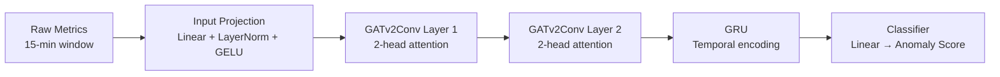
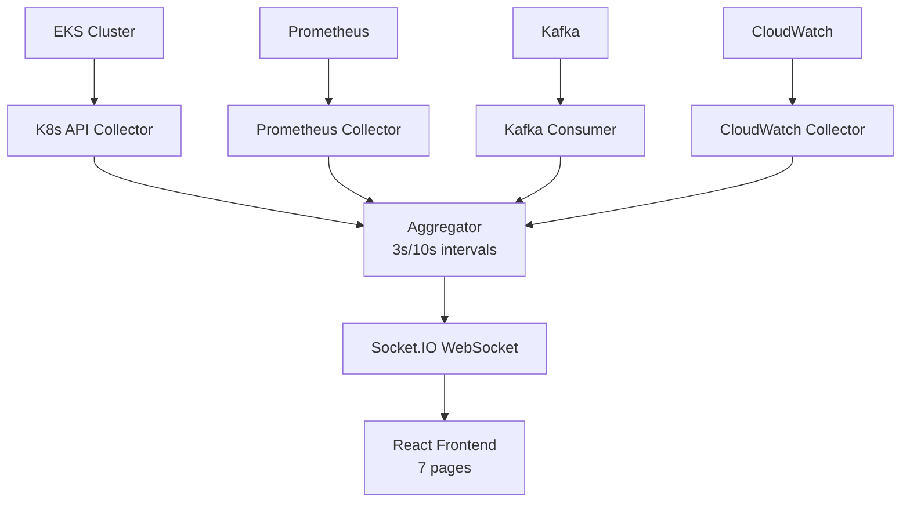
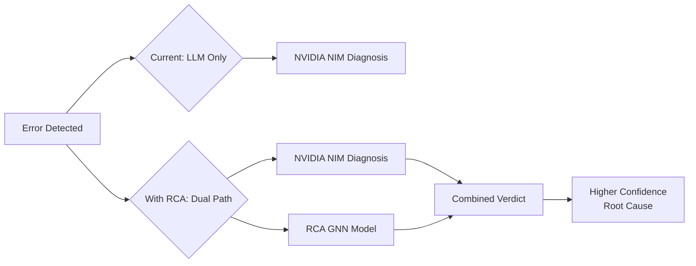

# Honest Analysis: RCA Model & Dashboard

## Part 1: RCA Model (`rca_model/`)

### What It Actually Is
A **Spatio-Temporal Graph Neural Network** (GAT + GRU) trained on the **GAIA benchmark dataset** for microservice Root Cause Analysis. It's a PyTorch model with ~25 weight tensors (~200KB total).

### Architecture

| Component | Details |
|-----------|---------|
| **Input** | `[batch, 15 timesteps, N nodes, F features]` — 15-min sliding window of per-service metrics |
| **Spatial** | 2x GATv2Conv layers model service-to-service dependencies (e.g., webservice→dbservice) |
| **Temporal** | 1-layer GRU captures how metrics evolve over time |
| **Output** | Per-node binary anomaly probability (which service is the root cause?) |
| **Loss** | Focal Loss (handles extreme class imbalance — anomalies are rare) |
| **Training** | GAIA dataset from Kaggle, 100 epochs, early stopping, AdamW |

### What It Does Well
- **Graph-aware**: Understands microservice topology (webservice1 → dbservice1, etc.)
- **Temporal-aware**: Uses 15 minutes of history, not just a single snapshot
- **Root cause localization**: Doesn't just detect anomalies — ranks WHICH service caused it
- **Synthetic test**: Successfully isolates injected memory spike to the correct node

### Honest Problems

> [!WARNING]
> **Critical Issue: Domain Mismatch**
> The model was trained on GAIA dataset services (`webservice1`, `dbservice1`, `redisservice1`, `logservice1`, `mobservice2`, etc.) — NOT your actual services (`catalog-service`, `cart-service`, `order-service`). The hardcoded topology in `build_service_topology()` maps GAIA-specific service names.

> [!WARNING]
> **Critical Issue: Feature Mismatch**
> GAIA provides 159 pre-engineered metric features per node per timestep. Your EKS cluster exposes raw Prometheus counters, pod logs, and K8s events — completely different feature space. You cannot feed raw K8s data into this model without a feature engineering pipeline.

> [!CAUTION]
> **The saved model weights are GAIA-specific.** You would need to either:
> 1. Retrain from scratch on YOUR infrastructure's metrics
> 2. Fine-tune with synthetic data generated from your services
> 3. Build a feature adapter that translates your metrics to GAIA-like format

### Integration Assessment

| Aspect | Rating | Notes |
|--------|--------|-------|
| Code Quality | ⭐⭐⭐⭐ | Clean, well-structured notebook with clear sections |
| Model Architecture | ⭐⭐⭐⭐ | GATv2 + GRU is state-of-the-art for RCA |
| Applicability to Our System | ⭐⭐ | Needs retraining + feature engineering for ammazone services |
| Integration Effort | HIGH | ~2-3 weeks to make it work with real data |

---

## Part 2: Dashboard (`dashboard/dashboard-aws-main/`)

### What It Actually Is
A **real-time observability dashboard** with 3 components:

| Component | Tech | Purpose |
|-----------|------|---------|
| `smartops-frontend` | React + Vite + TailwindCSS | 7-page monitoring UI |
| `smartops-backend` | Express + Socket.IO | Aggregates data from 4 sources |
| `result-portal-backend` | Express | Telemetry middleware + auth routes |

### Architecture

### Dashboard Pages
1. **Overview** — Cluster health, RPS, active users, P95 latency, error rate, HPA replicas, live login events
2. **Kubernetes** — Pod list, node status, deployments, services, events
3. **Metrics** — Prometheus metrics (CPU, memory, network per pod/node)
4. **Logs Stream** — CloudWatch log tail
5. **Kafka Streams** — Login event stream from Kafka
6. **Autoscaling** — HPA status
7. **Health** — Connection status for K8s, Prometheus, Kafka, CloudWatch, WebSocket

### What It Does Well
- **Real-time**: WebSocket push every 3 seconds — no polling from frontend
- **Multi-source**: Aggregates K8s API + Prometheus + CloudWatch + Kafka into one view
- **Clean UI**: TailwindCSS dark theme, lucide-react icons, proper card components
- **EKS Telemetry Bridge**: Clever log-to-Kafka bridge (`eks-telemetry-bridge.js`)

### Honest Problems

> [!WARNING]
> **Dependency Problem: Prometheus + Kafka Required**
> This dashboard requires Prometheus and Kafka running in the cluster. Currently your EKS cluster does NOT have either. On `t3.micro` nodes, these would eat all remaining pod capacity (Prometheus alone needs 2-3 pods, Kafka needs 3-5).

> [!IMPORTANT]
> **Built for a Different App**: The dashboard was designed for an `aurcc-backend` (student portal with login/results) — not the ammazone e-commerce platform. The Kafka topic is `login-events`, the telemetry bridge watches `app=aurcc-backend`, and the result-portal-backend tracks `registrationNo` and `department`.

> [!NOTE]
> **No SmartOps Agent Integration**: The dashboard shows infrastructure metrics but has NO awareness of the SmartOps incident pipeline. There's no "Incidents" page, no LLM diagnosis view, no PR tracking.

### Integration Assessment

| Aspect | Rating | Notes |
|--------|--------|-------|
| Code Quality | ⭐⭐⭐⭐ | Well-organized, proper separation of concerns |
| UI Design | ⭐⭐⭐⭐ | Professional dark theme, real-time cards |
| Applicability to Our System | ⭐⭐⭐ | K8s + CloudWatch collectors work as-is; Prometheus/Kafka need infra |
| Integration Effort | MEDIUM | ~1 week to adapt and deploy |

---

## How They Could Improve Our Self-Healing System

### RCA Model — Integration Path

The model is valuable as a **second opinion layer** alongside the LLM diagnosis. Here's how:

**Practical integration steps:**
1. **Build a metrics collector** in the SmartOps agent that records CPU, memory, error rate per service every minute
2. **Create a feature engineering pipeline** that converts raw K8s metrics → 159-dim GAIA-like feature vectors
3. **Retrain the model** on your ammazone topology (catalog-service, cart-service, order-service)
4. **Serve inference** as a sidecar container or Python microservice
5. **Feed results to the reasoning chain** as additional context: "RCA model says 87% confidence catalog-service is root cause"

**Honest verdict**: The architecture is sound, but the SAVED MODEL is not usable as-is. You need to retrain on your own data. The notebook is a good starting point.

---

### Dashboard — Integration Path

The dashboard is immediately more useful. Here's how to integrate:

**Phase 1 — Quick Win (works today):**
- Deploy the backend with ONLY the K8s collector and CloudWatch collector (skip Prometheus/Kafka)
- Add a new page: **"Incidents"** that shows SmartOps agent incidents
- Connect to the agent's health endpoint for live status

**Phase 2 — Full Integration:**
- Add a new Socket.IO event: `incident:update` emitted by the SmartOps agent
- Build an Incidents page showing: detection time, diagnosis, proposed fix, status, PR link
- Add an **"Approve from Dashboard"** button (instead of only Slack)
- Show the audit trail from S3

**Phase 3 — With RCA (future):**
- Add a **"RCA Analysis"** page showing the GNN model's per-service anomaly heatmap
- Overlay RCA confidence scores on the Kubernetes pod view

---

## Summary: My Recommendation

| Item | Use Now? | Why |
|------|----------|-----|
| **RCA Model Architecture** | ✅ Keep the code | Excellent GNN design, but needs retraining |
| **RCA Saved Weights** | ❌ Cannot use | Trained on GAIA, not your services |
| **Dashboard Frontend** | ✅ Deploy with changes | Great UI, needs Incidents page and service name fixes |
| **Dashboard K8s Collector** | ✅ Use as-is | Already talks to K8s API, works with your cluster |
| **Dashboard Prometheus Collector** | ⚠️ Later | Needs Prometheus deployed (resource-heavy) |
| **Dashboard Kafka Collector** | ⚠️ Later | Needs Kafka deployed (resource-heavy) |
| **Dashboard CloudWatch Collector** | ✅ Use as-is | You already have CloudWatch |
| **Result Portal Backend** | ❌ Skip | Built for a student portal, not relevant |
| **EKS Telemetry Bridge** | ❌ Skip | Watches `aurcc-backend`, not ammazone |

> [!TIP]
> **My recommended priority:**
> 1. Deploy the dashboard with K8s + CloudWatch collectors (skip Prometheus/Kafka for now)
> 2. Add an **Incidents page** that reads from the SmartOps agent API
> 3. Later: retrain the RCA model on your infrastructure data
